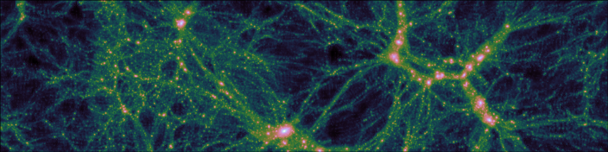

# Cosmological structure

The large-scale distribution of billions of galaxies contains a wealth of information about the origin, expansion, and contents of the Universe. For example, the galaxy distribution is sensitive to the amounts of dark energy and dark matter, the current and historial expansion speed, and the process of inflation that occurred soon after the big bang and which seeded the diverse array of cosmological structure, including all galaxies, stars and planets, that we see today. Galaxies exist in dense clumps, called groups, clusters, super clusters, depending on the number, at the nodes of the density distribution. It follows that by measuring with distribution of galaxies we can infer things about the fundamental make-up of the cosmos.

The underlying density structure is governed by the dynamics and properties of dark matter, which defines a skeleton along which gas can flow and clump. This gas eventually cools through radiative processes, which allows it to contract and eventually form galaxies and stars.

The above image shows a slice through an $N$-body simulation, 50 Mpc across, which would take light 150 million years to cross. The dense regions are aggregations of dark matter that would contain many hundreds or even thousands of galaxies. High-resolution simulations such as this are expensive to run, taking many weeks to run on the largest super computers in the world. For each simulation, a distinct choice must be made about the underlying parameters of the universe being simulated, for example, one must choose the amount of dark matter and dark energy, the expansion speed, and properties of the primordial matter distribution.

To extract cosmological information from the galaxy distribution requires precise models of the statistical properties of the distribution as a function of the underlying parameters. Analytical linear theories, developed over the last 30 years, work at early times in the history of the Universe and on extremely large scales, where perturbations to the mean density are small. However, on the (comparatively small) scale of galaxies, the perturbations are huge and modelling their distribution can only be accurately achieved using expensive $N$-body simulations. It is impractical to run accurate simulations at all points in parameter space, especially since the space of models under investigation is ever expanding. In modern cosmology, this includes the space of exotic dark energy models, beyond-Einstein gravity theories, and non-standard particle physics models for dark matter and neutrinos.

In this example, we use `twinLab` to create an emulator for the matter power spectrum, a statistical quantity that contains (a large subset of) the information from the clustering distribution of galaxies. The power spectrum can both be computed via simulation and also measured in observational datasets. An example power spectrum for a specific set of cosmological parameters is shown above, where the data and model overlap very well (almost perfectly).

The training of the `twinLab` emulator is performed online (in the cloud) and is completed in a matter of minutes. Once trained, the emulator can be used for extremely rapid power-spectrum evaluation across parameter space in a way that interpolates and extrapolates reasonably. The major benefit of using `twinLab` is that we get an accurate estimate of our model uncertainty for free, so that we know exactly how much we should trust our trained surrogate model. In this example, the model is trained on approximate simulation data that occupy a Latin-hypercube distribution across five parameters of interest to cosmologists. The model can be rapidly retrained if necessary, and additional parameters can be incorporated. In this way, we can test emulator construction as a function of underlying cosmological parameters, and we can learn how many simulations might be required in future simulation campaigns to get a reasonable distribution of simulations across the full parameter space.

Using `twinLab`, we train a functional Gaussian Process to act as a surrogate model for the power spectrum. We specify five cosmological parameters as inputs (in that, we wish to create an emulator for the power spectrum as a function of these 5 parameters) and output the power spectrum at some pre-determined wave-numbers. The data-points that comprise a smooth function are obviously very strongly correlated, because the value of the power at each wave-number depends very strongly on the value of the power at neighbouring wave-numbers. A functional Gaussian Process decomposes the set of training data into a set of basis functions that is determined by the data themselves. The sum of these functions then capture the overall shapes of all possible power spectra, and the exact coefficients used in the sum are then the numbers that are learned (as a function of cosmological parameters inputs) when the Gaussian Process is trained.

The above shows the performance of the surrogate model on training data (orange) and on unseen test data (blue) for 10 independent examples of each. The target of interest is the ratio of the model prediction to the "truth", across a range of Fourier wave-numbers, which we can compute exactly in this case. We see that the predictions are generally excellent on the training data. On the test data, we still see good performance, but the error creeps up to around a few per-cent for some sets of cosmological parameters. We also see that the emulator-predicted error is a good indication of actual uncertainty (i.e., the model error is larger when the model is more wrong). The error-bound can therefore be taken to be a conservative estimate of the error inherent in the emulator. This could be decreased by providing more training examples for the emulator, which would also be necessary if the model were to be expanded to a larger set of cosmological parameters.

The above image shows a mock density field constructed using the output from the emulator, which takes a few seconds to generate. The region of the Universe shown is 500 megaparsecs across and one megaparsec deep, which would contain approximately 250,000 galaxies and would take light more than 1.5 billion years to cross. Galaxies are clustered into huge superclusters, which are joined by filaments and separated by voids. Clearly the image is of low-resolution compared to the full simulation, but huge numbers of low-resolution mock universes such as these are useful for understanding the statistical correlations present in the Universe as a function of the underlying parameters.

